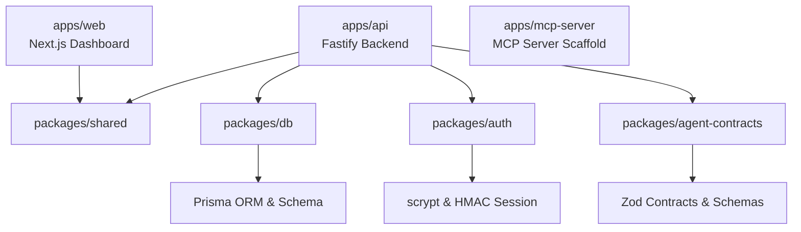

# AgentReady Implementation Context & Handoff Guide

This document provides a comprehensive technical overview of the current state of AgentReady. It is designed to give developers, thinking partners, and AI assistants immediate context on the system's architecture, data models, completed implementations, and next development steps.

---

## 1. Project Overview & Architecture

AgentReady is an **agent-first B2B SaaS platform** built to make software usage by autonomous AI agents safe, observable, testable, and auditable. Rather than allowing agents raw, uncontrolled access to APIs, AgentReady acts as a governed middleware and observation layer.

The codebase is structured as a **TypeScript monorepo** managed with `pnpm` workspaces:



### Module Layout
- **`apps/web`**: Next.js 15 dashboard. Includes full navigation, KPI cards, execution detail view, approval queue, feature flag management, and a regression analysis panel.
- **`apps/api`**: Fastify modular backend containing modules for tenant management, authentication, executions, governance, observability, eval framework, and auditing.
- **`apps/mcp-server`**: A shell for future Model Context Protocol (MCP) server integration.
- **`packages/db`**: Central database package containing the Prisma schema, client generator, and helper utilities.
- **`packages/shared`**: Shared types, Zod schemas, and utility functions used across frontend and backend.
- **`packages/auth`**: Low-level password hashing and session signature/verification routines.
- **`packages/agent-contracts`**: Data structures and schemas defining task contracts for agents.

---

## 2. Core Implemented Features

### A. Authentication & Session Management
- **Password Security**: Implemented using Node's native `scrypt` hashing in [`packages/auth/src/index.ts`](../packages/auth/src/index.ts).
- **Stateless Cookie Sessions**: Sessions are signed using HMAC-SHA256, stored in HTTP-only `SameSite=Lax` cookies (`agentready_session`).
- **Auth Routes**: `/api/v1/auth/register`, `/login`, `/logout`, `/me`.

### B. Strict Multi-Tenancy Enforcement
- **Server-Derived Context**: Protected routes derive `organizationId` exclusively from the validated session. Request bodies/queries never include `organizationId`.
- **Relational Tenancy Isolation**: Services assert that linked `project`, `task`, `contract`, and `agent` all belong to the authenticated organization before writes.
- **Cross-Org Leak Prevention**: Listing endpoints filter strictly by session `organizationId`. `findById` queries use composite org+id where clauses, returning `404` (not `403`) to avoid data existence leakage.

### C. Standardized Error Handling
- **Global Exception Filter**: All errors are normalized to:
    ```json
    {
      "error": {
        "code": "ERROR_CODE",
        "message": "User-friendly message.",
        "details": { "requestId": "unique-request-id" }
      }
    }
    ```
- **Covered Cases**: Zod validation, Prisma constraints (`P2002`, `P2025`, `P2003`), HTTP exceptions, rate-limit triggers, CORS rejections.

### D. Agent Execution State Machine
- **Lifecycle Management**:
    ```
    [QUEUED] ──> [RUNNING] ──> [WAITING_FOR_APPROVAL] ──> [SUCCEEDED] / [FAILED] / [CANCELLED]
    ```
- **Transition Rules**: `assertExecutionTransition` in `executionStateMachine.ts` is called before any status update, preventing invalid or out-of-order transitions.

### E. Governance: Feature Flags & Approval Gates
- **Capability Enablement (Feature Flags)**: Hierarchical — agent-specific settings override org-wide defaults. Controls:
  - `agent_execution` — block/allow run creation
  - `tool_execution` — block/allow custom tool calls
  - `eval_runner` — block/allow eval framework
  - `mcp_server_access` — restrict MCP server listing
  - `auto_approval` — when disabled, forces all `AUTOMATIC` gates to `REQUIRE_APPROVAL`
- **Policy Enforcement (Approval Gates)**: Modes:
  - `AUTOMATIC` — allow without human intervention
  - `REQUIRE_APPROVAL` — suspend execution, create `ApprovalRequest`, set trace to `BLOCKED`, transition execution to `WAITING_FOR_APPROVAL`
  - `BLOCKED` — deny entirely
- **Human Review**: `POST /api/v1/approval-requests/:id/review` with `{ status: "APPROVED"|"REJECTED", note? }`:
  - *Approve*: transitions execution back to `RUNNING`
  - *Reject*: transitions execution to `FAILED` (terminal)

### F. Awaited Audit Logging
- **Synchronous, awaited** writes for sensitive operations — auth events, execution creation, gate updates, flag toggles, approval reviews.
- **Actor Classification**: `USER`, `AGENT`, `SYSTEM` source fields.
- **Audit Log Endpoint**: `GET /api/v1/audit-logs` (org-scoped, optional `limit` up to 100).

### G. Production-Minded Evaluation Framework
- **Eval Cases**: `EvalCase` model specifying name, contract, inputs, expected status, expected tool calls, and success criteria.
- **Harness Execution**: Runs through the actual execution lifecycle (`QUEUED` → `RUNNING` → terminal).
- **Deterministic Scoring**:
    ```
    score = (statusMatch + toolsMatch) / 2
    ```
  A score of `1.0` = `PASSED`; anything less = `FAILED`.
- **Suite Runs**: `POST /api/v1/eval-suites/run` executes all cases for a contract.

### H. Eval Regression Comparison
- **Delta Tracking**: `GET /api/v1/eval-runs/regression` computes:
  - previous/current average score
  - score delta
  - pass rate change
  - newly failing cases
  - newly passing cases
- **Dashboard**: Regression card shown on the overview page.

### I. Frontend Dashboard (Next.js)
- **Navigation**: Full sidebar/topbar `Navbar` linking to: Overview, Agents, Task Contracts, Executions, Traces, Evals, Approval Queue, Feature Flags, Audit Logs, MCP.
- **Overview KPI Cards**: Total executions, success rate, failed executions, pending approvals, eval pass rate, disabled critical flags, registered MCP servers.
- **Loading / Empty / Error States**: All pages show skeletons while loading, guided empty states, and visible API error banners with fallback demo data.
- **API Client**: Centralized in `apps/web/src/lib/api.ts` with typed interfaces and typed fallback data for all endpoints.

### J. Execution Detail Page (`/executions/[id]`)
- Shows execution metadata: status, agent, task contract, project, start/end times, duration, failure reason.
- **Trace Timeline**: Ordered list of `ToolCallTrace` events with color-coded status badges, latency, input/output summaries.
- **Highlighted Events**: `approval_requested`, `tool_failed`, `run_failed`, `run_succeeded`.
- No secrets exposed — output/error fields are truncated to safe summaries.

### K. Approval Queue UI (`/approval-queue`)
- Lists pending approval requests with action name, risk level badge, agent name, relative timestamp, reason, and input payload preview.
- **Approve**: One-click action that calls `POST /api/v1/approval-requests/:id/review` with `APPROVED`.
- **Reject**: Opens a modal requiring a non-empty rejection note before confirming (enforced client-side and API-side).
- **Filter Tabs**: "Pending" (default) vs. "All requests".
- **States**: Loading skeletons, empty state ("All Clear" message), error banner with fallback demo data.
- After decision, card updates inline to show `APPROVED` / `REJECTED` without a page reload.

---

## 3. API Endpoints Reference

| Module | Method | Path | Description |
|:---|:---|:---|:---|
| Auth | POST | `/api/v1/auth/register` | Register user + org |
| Auth | POST | `/api/v1/auth/login` | Login, set session cookie |
| Auth | POST | `/api/v1/auth/logout` | Clear session |
| Auth | GET | `/api/v1/auth/me` | Current session info |
| Executions | POST | `/api/v1/executions` | Create new execution |
| Executions | GET | `/api/v1/executions` | List org executions |
| Executions | GET | `/api/v1/executions/:id` | Get execution detail |
| Executions | PATCH | `/api/v1/executions/:id` | Update execution status |
| Tool Traces | POST | `/api/v1/tool-call-traces` | Record tool call (gate enforcement) |
| Tool Traces | GET | `/api/v1/tool-call-traces` | List tool traces |
| Contracts | POST | `/api/v1/task-contracts` | Create task contract |
| Contracts | GET | `/api/v1/task-contracts` | List task contracts |
| Contracts | GET | `/api/v1/task-contracts/:id` | Get contract |
| Governance | GET | `/api/v1/approval-gates` | List approval gates |
| Governance | PUT | `/api/v1/approval-gates` | Upsert approval gate |
| Governance | GET | `/api/v1/feature-flags` | List feature flags |
| Governance | PUT | `/api/v1/feature-flags` | Upsert feature flag |
| Governance | POST | `/api/v1/feature-flags/toggle` | Toggle feature flag state |
| Governance | GET | `/api/v1/approval-requests` | List approval requests |
| Governance | POST | `/api/v1/approval-requests/:id/review` | Approve or reject request |
| Governance | GET | `/api/v1/mcp-servers` | List MCP server registrations |
| Evals | POST | `/api/v1/eval-runs` | Create eval run |
| Evals | GET | `/api/v1/eval-runs` | List eval runs |
| Evals | GET | `/api/v1/eval-runs/regression` | Regression comparison data |
| Eval Cases | POST | `/api/v1/eval-cases` | Create eval case |
| Eval Cases | GET | `/api/v1/eval-cases` | List eval cases |
| Eval Cases | POST | `/api/v1/eval-cases/:id/run` | Run single eval case |
| Eval Cases | POST | `/api/v1/eval-suites/run` | Run entire eval suite |
| Observability | GET | `/api/v1/observability/dashboard` | Aggregated dashboard metrics |
| Audit | GET | `/api/v1/audit-logs` | List audit logs |

---

## 4. Database Schema Design (Prisma)

| Model | Purpose | Key Attributes / Relations |
|:---|:---|:---|
| **Organization** | Primary tenant | Root owner of all resources |
| **User** / **OrganizationMember** | Humans with access | Roles: OWNER, ADMIN, MEMBER, VIEWER |
| **AgentIdentity** | Registered AI agents | Scoped to organization |
| **Project** / **Task** | Workspace context | Grouping for execution objectives |
| **TaskContract** | Executable rules | Inputs, success criteria, allowed tools, eval spec |
| **AgentExecution** | Individual execution | Status state machine, riskScore, output |
| **ToolCallTrace** | Per-step trace | Tool name, input/output, latency, approvalRequestId |
| **ApprovalRequest** | Suspended review | Action, payload, status, reviewer, note |
| **AuditLog** | Immutable history | Actor type, action, before/after, resourceId |
| **AgentFeatureFlag** | Capability toggles | State (ENABLED/DISABLED), agent or org scope |
| **ApprovalGate** | Policy rules | Mode (AUTOMATIC/REQUIRE_APPROVAL/BLOCKED), riskLevel |
| **EvalCase** | Test case definition | Contract, inputs, expected status/tools, criteria |
| **EvalRun** | Test execution result | Score, status, checks, findings, duration |
| **McpServerRegistration** | MCP gateway | Status, capabilities |

---

## 5. Local Setup Status & Development Gotchas

> [!WARNING]
> Review these environmental constraints before starting development.

1. **Docker/PostgreSQL Availability**:
   - Docker is currently **not** available in the local sandbox environment.
   - Integration tests use a fully in-memory mock — **no live database required to run tests**.
   - To run migrations/seed once PostgreSQL is available:
     ```bash
     cp .env.example .env
     # Start PostgreSQL
     pnpm db:migrate
     pnpm db:seed
     ```

2. **Mock DB Client & Test Architecture** (`apps/api/test/mockPrisma.ts`):
   - Reassigning generated Prisma methods requires a type cast proxy: `const mockPrisma = prisma as any;`
   - Array-based mocks do not sort or resolve relations automatically — services must sort results explicitly.
   - Prisma `upsert` with nullable fields in compound unique indexes fails typechecking; use `findFirst` + `create`/`update` instead.
   - `taskContract.create`, `taskContract.findMany`, and `taskContract.findFirst` are now mocked (added during critical flows test work).

3. **API Port Configuration**:
   - Backend: port `3001` (set via `API_PORT` in `.env`).
   - Frontend: reads `NEXT_PUBLIC_AGENTREADY_API_URL` (defaults to `http://localhost:3001`).
   - Demo fallback data is shown when the API is unreachable or unauthenticated — this is intentional for local UI work.

4. **CORS**:
   - Wildcard `*` origins are rejected because credentialed cookies are enabled.
   - Set `API_CORS_ORIGINS=http://localhost:3000` for local development.

---

## 6. Test Suite

All tests use **Node's built-in test runner** via `tsx` — no Jest, Vitest, or Mocha required.

### Running Tests

```bash
pnpm test          # All workspaces (API + web)
pnpm test:api      # API integration tests only
pnpm test:web      # Frontend smoke tests only
```

### Current Coverage: 62 tests, 0 failures

| Suite | Tests | Location | What it covers |
|:---|:---|:---|:---|
| Auth | 5 | `apps/api/test/auth.test.ts` | Register, login, session, me, invalid credentials |
| Execution State Machine | 6 | `apps/api/test/execution-state-machine.test.ts` | Valid/invalid transitions, terminal state protection |
| Tenancy | 3 | `apps/api/test/tenancy.test.ts` | Cross-org isolation, 403/404 boundary enforcement |
| Feature Flags | 6 | `apps/api/test/feature-flags.test.ts` | Flag blocking, toggle, audit logs, auto-approval override |
| Approval Gates | ~11 | `apps/api/test/approval-gates.test.ts` | Gate patterns, risk thresholds, approval lifecycle |
| Eval Framework | 6 | `apps/api/test/eval-framework.test.ts` | Case creation, scoring, suite runs |
| Eval Regression | 1 | `apps/api/test/regression.test.ts` | Delta computation, newly passing/failing |
| **Critical Flows** | **11** | `apps/api/test/critical-flows.test.ts` | End-to-end: register→login→contract→exec→trace→approval→eval |
| **Frontend Smoke** | **19** | `apps/web/test/smoke.test.ts` | Data contracts, status enums, type shapes, regression math |

### Critical Flows Test Coverage

The `critical-flows.test.ts` suite exercises 8 end-to-end API paths in a single test file:
1. Register user → org/membership created, session cookie returned
2. Login with credentials → session returned
3. Create task contract → list returns it, org-scoped
4. Cross-org contract isolation (not leaked to other orgs)
5. Start agent execution → status=QUEUED, org-derived from session
6. Tool trace creation → persisted in mock store
7. REQUIRE_APPROVAL gate → trace=BLOCKED, execution=WAITING_FOR_APPROVAL, ApprovalRequest created
8. Approve → execution transitions to RUNNING
9. Reject → execution transitions to FAILED (terminal)
10. Disabled `agent_execution` flag → POST returns 403 FORBIDDEN
11. Eval run created with org scope and linked executionId

---

## 7. Upcoming Roadmap

- [ ] **Frontend Auth Screens**: Build `/register` and `/login` UI; wire session cookies to Next.js fetch layer.
- [ ] **Role-Based Access Controls (RBAC)**: Validate member roles (`OWNER`, `ADMIN`, `MEMBER`, `VIEWER`) on sensitive endpoints.
- [ ] **Execution Background Runner**: Poll `QUEUED` executions and transition to `RUNNING` via an isolated worker.
- [ ] **Typed API Response Contracts**: Share response types between `apps/api` and `apps/web` via `packages/shared`.
- [ ] **Audit Log UI**: Frontend page for browsing and filtering audit log entries.
- [ ] **Password Reset / Invite Flow**: Email-based credential recovery and team invites.
