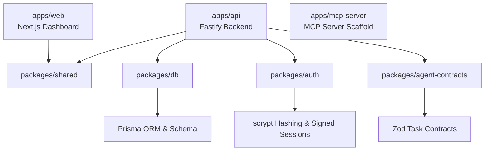

# AgentReady Implementation Context & Handoff Guide

This document provides a comprehensive technical overview of the current state of AgentReady. It is designed to give developers, thinking partners, and AI assistants immediate context on the monorepo architecture, core modules, completed security/observability implementations, and the verification framework.

---

## 1. Project Overview & Architecture

AgentReady is an **agent-first B2B SaaS platform** designed to make autonomous tool use by AI agents safe, observable, testable, and governed. Rather than allowing agents raw, unmonitored access to APIs or tools, AgentReady acts as a secure middleware, policy coordinator, and execution supervisor.

The monorepo utilizes `pnpm` workspaces:



### Component Structure
*   **`apps/web`**: Next.js 15 dashboard showing metrics, recent executions, pending human reviews, feature flags, and regression reports.
*   **`apps/api`**: Fastify modular backend containing the core business services.
*   **`apps/mcp-server`**: Model Context Protocol integration shell.
*   **`packages/db`**: Encapsulates the Prisma schema, client generator, and in-memory mock client context.
*   **`packages/shared`**: Shared TypeScript models, schemas, and schemas validation objects.
*   **`packages/auth`**: Scrypt password utility and signed session signatures logic.
*   **`packages/agent-contracts`**: Definitions and structure matching agent task limits.

---

## 2. Core Governance & Observability Modules

### A. Stateless Authentication
*   Uses cryptographically signed HTTP-only cookies (`agentready_session`) with `SameSite=Lax`.
*   Passwords are encrypted using Node's native `scrypt` hash algorithm.

### B. Relational Multi-Tenancy Scoping
*   Clients never supply `organizationId` directly in query parameters or request bodies.
*   The system extracts `organizationId` strictly from the signed session (`request.authContext`).
*   Services enforce tenancy constraints recursively; before writing related objects (e.g., executing a run), the repository layer asserts that the linked Project, Task Contract, and Agent Identity all belong to the same organization.

### C. Standardized Exceptions Filter
*   Central handler standardizes validation exceptions, Prisma constraints (unique, foreign key violations), rate limits, CORS rejections, and raw failures into a clean user-facing envelope:
    ```json
    {
      "error": {
        "code": "ERROR_CODE",
        "message": "User-friendly description.",
        "details": { "requestId": "request-tracing-uuid" }
      }
    }
    ```

### D. Execution State Machine
*   Governs transitions through states:
    ```
    [QUEUED] ──> [RUNNING] ──> [WAITING_FOR_APPROVAL] ──> [SUCCEEDED] / [FAILED] / [CANCELLED]
    ```
*   Ensures that executions cannot modify final states or skip required steps (e.g. jumping from queued directly to succeeded).

### E. Feature Flags & Approval Reviews
*   **Hierarchical Feature Flags**: Scopes configurations like execution limits (`agent_execution`), custom integrations (`tool_execution`), testing modules (`eval_runner`), gateway views (`mcp_server_access`), and bypass rules (`auto_approval`). Agent-specific flags override organization-wide defaults.
*   **Approval Gates Policy Reviews**: Matches tool capabilities (e.g. `file_write`) to enforce approval modes (`AUTOMATIC`, `REQUIRE_APPROVAL`, `BLOCKED`).
    *   If a capability requires review, execution pauses (`WAITING_FOR_APPROVAL`), the tool call trace status is marked `BLOCKED` with the code `approval_requested`, and an `ApprovalRequest` is queued.
    *   Admins review requests at `POST /api/v1/approval-requests/:id/review` (Approving resumes execution; rejecting terminates the run as `FAILED`).
    *   If `auto_approval` is disabled in feature flags, all `AUTOMATIC` gates fall back to manual review.

### F. Production-Minded Evaluation Framework
*   **Eval Cases**: Test cases specifying target contract, input parameters, expected terminal status, expected tool calls array, and success criteria.
*   **Harness Integration & Scoring**: Runs tests through the exact execution lifecycle state path and computes a deterministic rule-based score:
    ```
    score = (statusMatch + toolsMatch) / 2
    ```
    Evals are stored as `EvalRun` records containing pass/fail indicators, float score, duration, and failure reasons.

### G. Regression Comparison
*   **Analytics Endpoint**: `GET /api/v1/eval-runs/regression` computes current vs. previous averages, score deltas, pass rate changes, newly passing cases, and newly failing cases by grouping runs and sorting case activity chronologically.
*   **Dashboard View**: Integrates a dedicated card displaying delta directions and lists of regression items with colored warning indicators.

---

## 3. Database Schema Design (Prisma)

The schema defines a rich relational layout mapping enterprise tenancy to agent operations:

| Model | Purpose | Key Attributes / Relations |
| :--- | :--- | :--- |
| **Organization** | The primary tenant entity | Root owner of users, members, agents, projects, and execution traces. |
| **User** / **Member** | Humans with system access | Scoped to organizations via `OrganizationMember` with roles (Owner, Admin, Member, Viewer). |
| **AgentIdentity** | Registered AI agents | Represents autonomous actors executing tasks. Scoped to Organization. |
| **Project** / **Task** | Workspace context | Grouping mechanisms for execution objectives. |
| **TaskContract** | Executable rules for agents | Declares required inputs, success criteria, allowed tools, and required evaluations. |
| **AgentExecution** | Individual execution instance | Tracks agent status (`QUEUED`, `RUNNING`, etc.), objectives, outputs, and risk scores. |
| **ToolCallTrace** | Execution step level trace | Stores inputs, outputs, errors, latency, and reference to approvals for a specific tool call. |
| **ApprovalRequest** | Suspended capability review | Holds action payloads, status (`PENDING`, `APPROVED`, etc.), and reviewer details. |
| **AuditLog** | Immutable activity history | Records `actorType` (`USER`, `AGENT`, `SYSTEM`), action description, and meta payloads. |
| **AgentFeatureFlag** / **ApprovalGate** | Security settings | Controls allowed capability states and review workflows. |
| **EvalCase** / **EvalRun** | Test cases & runs | Manages assertions, scores, metrics, and regression states. |
| **McpServerRegistration** | MCP registry | Scoped gateway integrations. |

---

## 4. Local Verification & Development Gotchas

1.  **In-Memory Sandbox Testing**:
    *   No live PostgreSQL instance is available in local developer execution environments.
    *   **Workaround**: Integration tests utilize a custom array-based in-memory mock client at `apps/api/test/mockPrisma.ts`.
    *   *Gotcha*: Reassigning Prisma methods triggers typescript compiler warnings. Overrides use type proxy casting: `const mockPrisma = prisma as any;`.
    *   *Gotcha*: Array-based mocks do not sort records automatically. Service layers handle sorting explicitly:
        ```typescript
        caseRuns.sort((a, b) => new Date(b.createdAt).getTime() - new Date(a.createdAt).getTime());
        ```
    *   *Gotcha*: prisma `upsert` inputs on compound unique indexes enforce non-nullable fields. Optional fields (like `agentId` in `AgentFeatureFlag` unique indexes) must be resolved by checking first with `findFirst` and executing explicit `create`/`update`.
2.  **API Port Mapping**:
    *   Backend serves on port `3001`. Next.js web application targets `AGENTREADY_API_URL=http://localhost:3001`.

---

## 5. Upcoming Roadmap

*   [ ] **Frontend User Credentials Screens**:
    *   Build register/login forms, handle cookie validation, and session recovery views.
*   [ ] **Role-Based Access Controls (RBAC)**:
    *   Authorize organization members against endpoint classifications (`OWNER` vs `VIEWER`).
*   [ ] **Async Worker Queue**:
    *   Extract execution state processing into an isolated worker polling queue.
