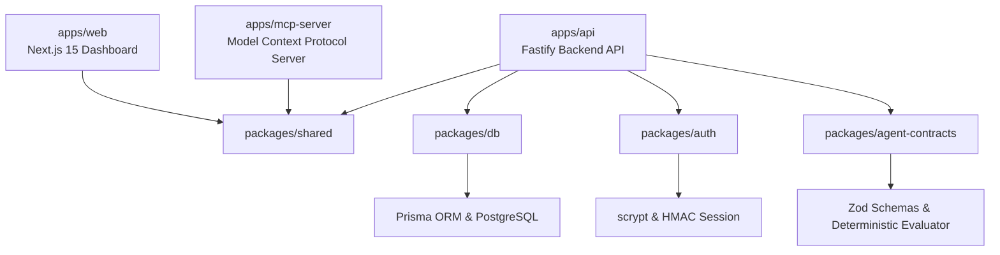

# AgentReady Implementation Context & Handoff Guide

This document provides a comprehensive technical overview of the current state of AgentReady. It is designed to give developers, thinking partners, and AI assistants immediate context on the system's architecture, data models, completed implementations, and next development steps.

---

## 1. Project Overview & Architecture

AgentReady is an **agent-first B2B SaaS platform** built to make software usage by autonomous AI agents safe, observable, testable, and auditable. Rather than allowing agents raw, uncontrolled access to APIs, AgentReady acts as a governed middleware, deterministic policy enforcement layer, and real-time observation platform.

The codebase is structured as a **TypeScript monorepo** managed with `pnpm` workspaces:



### Module Layout
- **`apps/web`**: Next.js 15 dashboard. Includes the redesigned executive Overview with 4 primary KPI cards, a live System Health Ribbon, an interactive collapsible `SandboxController` console, and dedicated management views for `/executions`, `/approval-queue`, `/feature-flags`, `/audit-logs`, `/api-keys`, `/task-contracts`, and `/evals`.
- **`apps/api`**: Fastify modular backend containing modules for tenant management, authentication, executions, governance, synchronous tool pre-flight checks, observability, evaluation frameworks, background worker claims, and audit logging.
- **`apps/mcp-server`**: Model Context Protocol (MCP) server on standard I/O (stdio) transport exposing read-only organization context and gated write actions (like `start_execution`) to LLM clients via Bearer API key authentication.
- **`packages/db`**: Central database package containing the Prisma schema, client generator, migration scripts, and connection health utilities.
- **`packages/shared`**: Shared types, Zod schemas, pattern-matching utilities, and constants used across frontend and backend.
- **`packages/auth`**: Low-level password hashing (`scrypt`) and HMAC-SHA256 session signature/verification routines.
- **`packages/agent-contracts`**: Data structures, Zod contracts, and pure deterministic trajectory evaluation engine (`evaluateTrajectoryTraces`) for continuous agent governance.

---

## 2. Core Implemented Features

### A. Authentication & Session Management
- **Password Security**: Implemented using Node's native `scrypt` hashing in [`packages/auth/src/index.ts`](../packages/auth/src/index.ts).
- **Stateless Cookie Sessions**: Sessions are signed using HMAC-SHA256, stored in HTTP-only `SameSite=Lax` cookies (`agentready_session`). In production, cookies enforce `Secure=true`.
- **Auth Routes**: `/api/v1/auth/register`, `/login`, `/logout`, `/me`.
- **Production Guardrails**: In production (`NODE_ENV=production`), server startup fails fast if `AUTH_SESSION_SECRET` is missing or matches the development default.

### B. Strict Multi-Tenancy Enforcement
- **Server-Derived Context**: Protected routes derive `organizationId` exclusively from the validated session or API key. Request bodies and query parameters never accept client-supplied `organizationId`.
- **Relational Tenancy Isolation**: Services assert that linked `project`, `task`, `contract`, and `agent` all belong to the authenticated organization before writes.
- **Cross-Org Leak Prevention**: Listing endpoints filter strictly by session `organizationId`. `findById` queries use composite org+id where clauses, returning `404 NOT_FOUND` (not `403`) to avoid data existence leakage.

### C. Standardized Error Handling
- **Global Exception Filter**: All errors are normalized to:
    ```json
    {
      "error": {
        "code": "ERROR_CODE",
        "message": "User-friendly message.",
        "details": { "requestId": "unique-request-id" }
      }
    }
    ```
- **Covered Cases**: Zod validation (`VALIDATION_ERROR`), Prisma constraints (`P2002`, `P2025`, `P2003`), HTTP exceptions (`400`, `401`, `403`, `404`, `409`, `429`), rate-limit triggers, and CORS origin rejections.

### D. Agent Execution State Machine
- **Lifecycle Management**:
    ```
    [QUEUED] ──> [RUNNING] ──> [WAITING_FOR_APPROVAL] ──> [SUCCEEDED] / [FAILED] / [CANCELLED]
    ```
- **Transition Rules**: `assertExecutionTransition` in `executionStateMachine.ts` is called before any status update, strictly enforcing valid forward progression and protecting terminal states.

### E. Governance: Feature Flags & Approval Gates
- **Capability Enablement (Feature Flags)**: Hierarchical — agent-specific settings override org-wide defaults. Controls:
  - `agent_execution` — block/allow run creation
  - `tool_execution` — block/allow custom tool calls
  - `eval_runner` — block/allow eval framework
  - `mcp_server_access` — restrict MCP server listing
  - `auto_approval` — when disabled, forces all `AUTOMATIC` gates to `REQUIRE_APPROVAL`
- **Policy Enforcement (Approval Gates)**: Modes:
  - `AUTOMATIC` — allow without human intervention
  - `REQUIRE_APPROVAL` — suspend execution, create `ApprovalRequest`, set trace to `BLOCKED`, transition execution to `WAITING_FOR_APPROVAL`
  - `BLOCKED` — deny entirely (`403 Forbidden`)
- **Human Review**: `POST /api/v1/approval-requests/:id/review` with `{ status: "APPROVED"|"REJECTED", note? }`:
  - *Approve*: transitions execution back to `RUNNING`
  - *Reject*: requires a non-empty rejection note; transitions execution to `FAILED` (terminal)

### F. Synchronous Tool Call Governance (`/check` & `/result`)
- **Pre-Flight Inspection (`POST /api/v1/executions/:id/tool-calls/check`)**:
  - Evaluates requested tool call against active feature flags and approval gates before execution occurs.
  - **Single-Flight Concurrency Lock**: Prevents an agent from executing multiple unapproved tools concurrently (`409 Conflict`).
  - **Circuit Breaker**: After 3 consecutive blocked tool calls, trips the execution into terminal `FAILED` status.
  - **Idempotency & Secret Redaction**: Hashes arguments with SHA-256 after redacting known sensitive token keys (`apiKey`, `token`, `secret`, `password`).
- **Result Ingestion (`POST /api/v1/tool-calls/:traceId/result`)**:
  - Restricted exclusively to machine API keys (`AGENT` role).
  - Updates trace status (`SUCCEEDED` / `FAILED`), records latency (ms), stores sanitized output, and logs audit events.

### G. Continuous Trajectory Evaluation & Deterministic Evaluator Engine
- **Trajectory Policies**: Encoded in `TaskContract.trajectoryPolicy` defining valid execution paths:
  - `expectedSequence`: Array of ordered tool steps with exact tool names, required arguments, and optional flags.
  - `forbiddenTools`: Explicit blacklist of tools forbidden from ever executing under this contract.
  - `maxSteps`: Maximum allowable tool calls before failing execution.
  - `enforceStrictSequence`: Boolean flag requiring steps to match exact order without deviation.
- **Pure Deterministic Evaluator (`@agentready/agent-contracts`)**: Zero-LLM evaluator function `evaluateTrajectoryTraces` that evaluates recorded `ToolCallTrace` records against `trajectoryPolicy`. Returns:
  - `complianceScore`: Float between `0.0` and `1.0`.
  - `violations`: String array detailing missing steps, out-of-order execution, forbidden tool attempts, or parameter violations.
- **Composite Scoring Formula**:
  $$\text{Score} = \frac{\text{StatusMatch} + \text{ToolsMatch} + \text{TrajectoryScore}}{3}$$
  *(Preserves backward compatibility: falls back cleanly to `(statusMatch + toolsMatch) / 2` when no trajectory policy exists).*
- **Adversarial & Boundary Test Suite**: Seeded canonical FinTech Refund Governance contract with 5 continuous evaluation cases:
  - `TC-01`: Golden Path (Compliant trajectory: `verify_customer` → `calculate_refund` → `process_refund`)
  - `SEC-01`: Unauthorized Tool Injection (Agent attempts rogue `export_customer_data`)
  - `SEC-02`: Trajectory Skip / Bypass (Agent skips verification and jumps directly to refund)
  - `SEC-03`: Parameter Tampering (Refund amount exceeds contract policy limit)
  - `SEC-04`: Credential Exfiltration (Agent leaks API keys into output payload)
- **Headless CI/CD Regression Runner (`scripts/run-eval-regression.ts`)**:
  - Executed via `pnpm eval:regression`.
  - Runs headlessly in CI/CD pipelines (GitHub Actions, pre-commit hooks).
  - Generates ANSI-colored terminal output with side-by-side trajectory diffs and regression delta calculations.
  - Exits with `0` when all tests pass with zero regressions; exits with `1` on policy breaches or regressions.

### H. Awaited Synchronous Audit Logging & PostgreSQL Immutability
- **Synchronous Writes**: Sensitive operations (auth, key issuance, gate updates, flag toggles, approvals) await audit records before replying.
- **Actor Classification**: `USER`, `AGENT`, `SYSTEM` source fields.
- **Database Immutability Trigger**: Implemented via PostgreSQL migration `20260906170000_audit_log_immutability_trigger`. An active `BEFORE UPDATE OR DELETE` trigger blocks any modification or deletion of `AuditLog` rows.
- **Foreign Key Restrict**: `Organization` deletion is blocked (`onDelete: Restrict`) if audit logs exist, preventing accidental destruction of legal compliance trails.

### I. Model Context Protocol (MCP) Server
- **Standard Protocol Integration**: Implemented via `@modelcontextprotocol/sdk` on standard I/O (stdio) transport.
- **Machine Authentication**: Authenticates via `Authorization: Bearer <api_key>` resolved against SHA-256 database hashes.
- **Read-Only Discovery**:
  - `list_available_tools`: Combines allowed tools across contracts, feature flags, and approval gates.
  - `list_task_contracts`: Lists registered task contracts for caller's organization.
  - `get_contract_context`: Retrieves full contract specification including trajectory policies.
  - `get_execution_status`: Queries execution lifecycle and metadata.
- **Gated Action (`start_execution`)**: Checks active approval gates and feature flags prior to creating executions.

### J. Async Background Worker
- **Atomic Concurrency Claims**: Poller uses atomic `updateMany` queries (`WHERE id = ? AND status = "QUEUED"`) to transition executions to `RUNNING` with zero double-claims across concurrent worker processes.
- **Fail-Fast Production Validation**: Fails immediately with `CONFIG_ERROR` if `AGENT_RUNNER_WEBHOOK_URL` is unset in production.

### K. Role-Based Access Control (RBAC) & Machine Auth
- **Role Hierarchy**: `OWNER` > `ADMIN` > `APPROVER` > `MEMBER` > `VIEWER`.
- **Database Re-Read on Every Request**: User roles are verified from PostgreSQL on each request, ensuring mid-session role demotions (e.g. `ADMIN` → `VIEWER`) take effect immediately (`403 Forbidden`).
- **Machine API Keys**: Generated cryptographically with `ar_live_` or `ar_test_` prefixes, stored exclusively as SHA-256 hashes, with granular scopes (`executions:read`, `tool_calls:check`, etc.). Wildcard scopes (`*`) are strictly blocked per the Human Governance Invariant.

### L. Modern Frontend UI & Executive Overview Redesign
- **Redesigned Overview Dashboard (`/`)**:
  - **4 Executive KPI Cards**: *Total Executions*, *Success Rate*, *Pending Approvals* (with action indicator), and *Eval Compliance*.
  - **System Health Ribbon**: Live indicators for MCP Servers, active Approval Gates, Capability Flags, and Tool Traces.
  - **Collapsible Sandbox Controller**: Embedded simulation console with `Launch Simulator ⚡` / `Collapse Console ▲` toggles.
  - **Balanced 2-Column Workspace**: Operational tasks on the left (approvals, executions) and continuous governance on the right (eval regressions, active guardrails).
- **Dedicated Management & Observability Views**:
  - `/audit-logs`: Filterable audit trail by actor type with metadata inspection drawer and immutability badge.
  - `/api-keys`: Granular scope configuration, secret reveal modal, and active key management.
  - `/task-contracts`: Contract cards, JSON spec viewer, and policy inspection.
  - `/evals`: Regression KPIs, test case browser, execution history, and live run trigger.
  - `/approval-queue`: Pending authorization requests with rejection modal requiring mandatory notes.

---

## 3. API Endpoints Reference

| Module | Method | Path | Required Role / Scope | Description |
|:---|:---|:---|:---|:---|
| **Auth** | POST | `/api/v1/auth/register` | Public | Register user + organization |
| **Auth** | POST | `/api/v1/auth/login` | Public | Login, issue signed session cookie |
| **Auth** | POST | `/api/v1/auth/logout` | Authenticated | Invalidate session cookie |
| **Auth** | GET | `/api/v1/auth/me` | Authenticated | Get current session details |
| **Executions** | POST | `/api/v1/executions` | Session: Member+ / Key: `executions:write` | Create new execution |
| **Executions** | GET | `/api/v1/executions` | Session: Viewer+ / Key: `executions:read` | List organization executions |
| **Executions** | GET | `/api/v1/executions/:id` | Session: Viewer+ / Key: `executions:read` | Get execution details and timeline |
| **Executions** | PATCH | `/api/v1/executions/:id` | Session: Member+ / Key: `executions:write` | Update execution status |
| **Tool Governance** | POST | `/api/v1/executions/:id/tool-calls/check` | Session: Member+ / Key: `tool_calls:check` | Pre-flight policy inspection (single-flight, circuit breaker) |
| **Tool Governance** | POST | `/api/v1/tool-calls/:traceId/result` | Key: `tool_calls:result` (Machine only) | Ingest tool result, update latency, log audit event |
| **Tool Traces** | GET | `/api/v1/tool-call-traces` | Session: Viewer+ / Key: `traces:read` | List traces with pagination and `executionId` filter |
| **Contracts** | POST | `/api/v1/task-contracts` | Session: OWNER / ADMIN | Create task contract with trajectory policy |
| **Contracts** | GET | `/api/v1/task-contracts` | Session: Viewer+ / Key: `contracts:read` | List task contracts |
| **Contracts** | GET | `/api/v1/task-contracts/:id` | Session: Viewer+ / Key: `contracts:read` | Get contract by ID |
| **Governance** | GET | `/api/v1/approval-gates` | Session: Viewer+ / Key: `governance:read` | List approval policy gates |
| **Governance** | PUT | `/api/v1/approval-gates` | Session: OWNER / ADMIN | Upsert approval policy gate |
| **Governance** | GET | `/api/v1/feature-flags` | Session: Viewer+ / Key: `governance:read` | List capability feature flags |
| **Governance** | PUT | `/api/v1/feature-flags` | Session: OWNER / ADMIN | Upsert capability feature flag |
| **Governance** | POST | `/api/v1/feature-flags/toggle` | Session: OWNER / ADMIN | Toggle feature flag state |
| **Governance** | GET | `/api/v1/approval-requests` | Session: Viewer+ / Key: `governance:read` | List approval requests |
| **Governance** | POST | `/api/v1/approval-requests/:id/review` | Session: OWNER / ADMIN / APPROVER | Review (Approve/Reject) approval request |
| **Governance** | GET | `/api/v1/mcp-servers` | Session: Viewer+ / Key: `governance:read` | List registered MCP servers |
| **Evals** | POST | `/api/v1/eval-runs` | Session: Member+ / Key: `eval:write` | Record eval run result |
| **Evals** | GET | `/api/v1/eval-runs` | Session: Viewer+ / Key: `eval:read` | List eval runs |
| **Evals** | GET | `/api/v1/eval-runs/regression` | Session: Viewer+ / Key: `eval:read` | Calculate regression delta metrics |
| **Eval Cases** | POST | `/api/v1/eval-cases` | Session: OWNER / ADMIN | Create evaluation case |
| **Eval Cases** | GET | `/api/v1/eval-cases` | Session: Viewer+ / Key: `eval:read` | List evaluation cases |
| **Eval Cases** | POST | `/api/v1/eval-cases/:id/run` | Session: Member+ / Key: `eval:write` | Execute single evaluation case |
| **Eval Cases** | POST | `/api/v1/eval-suites/run` | Session: Member+ / Key: `eval:write` | Execute entire evaluation suite |
| **Observability** | GET | `/api/v1/observability/dashboard` | Session: Viewer+ / Key: `observability:read` | Aggregated executive dashboard telemetry |
| **Audit Logs** | GET | `/api/v1/audit-logs` | Session: Viewer+ / Key: `audit:read` | Paginated immutable audit trail |
| **API Keys** | POST | `/api/v1/api-keys` | Session: OWNER / ADMIN | Generate machine API key (scopes required) |
| **API Keys** | GET | `/api/v1/api-keys` | Session: OWNER / ADMIN | List active API keys |
| **API Keys** | DELETE | `/api/v1/api-keys/:id` | Session: OWNER / ADMIN | Revoke machine API key |

---

## 4. Database Schema Design (Prisma)

| Model | Purpose | Key Attributes / Relations |
|:---|:---|:---|
| **Organization** | Primary tenant | Root owner of all resources |
| **User** / **OrganizationMember** | Humans with access | Roles: `OWNER`, `ADMIN`, `MEMBER`, `VIEWER`, `APPROVER` |
| **ApiKey** | Machine credentials | Scoped Bearer keys, SHA-256 `keyHash`, `lastUsedAt`, expiration |
| **AgentIdentity** | Registered AI agents | Scoped to organization |
| **Project** / **Task** | Workspace context | Grouping for execution objectives |
| **TaskContract** | Executable rules | Inputs, criteria, allowed tools, `trajectoryPolicy Json?` |
| **AgentExecution** | Individual execution | Status state machine, riskScore, output, attempts |
| **ToolCallTrace** | Per-step trace | Tool name, input/output, latencyMs, approvalRequestId |
| **ApprovalRequest** | Suspended review | Action, payload, status, reviewer, reviewNote |
| **AuditLog** | Immutable history | PostgreSQL trigger protected, actor type, action, diff |
| **AgentFeatureFlag** | Capability toggles | State (`ENABLED`/`DISABLED`), agent or org scope |
| **ApprovalGate** | Policy rules | Mode (`AUTOMATIC`/`REQUIRE_APPROVAL`/`BLOCKED`), riskLevel |
| **EvalCase** | Test case definition | Contract, inputs, expected status/tools, criteria |
| **EvalRun** | Test execution result | Score, `trajectoryScore Float?`, `violations Json?`, status, checks |
| **IdempotencyKey** | Single-flight protection | `executionId`, `key`, `resultJson`, TTL expiration |
| **McpServerRegistration** | MCP gateway | Transport, status, capabilities |

---

## 5. Local Setup Status & Development Gotchas

1. **Dual-Track Database Strategy**:
   - **Option A (Docker)**: `pnpm db:up` spins local PostgreSQL on `localhost:5432`.
   - **Option B (Cloud/Hosted PostgreSQL)**: Supports Supabase, Neon, or RDS via `DATABASE_URL` and `DIRECT_URL`.
   - All 171 Tier 1 unit and contract tests run with an in-memory `mockPrisma` store — **zero Docker or live database required**.
2. **Migrations vs Push**:
   - For database deployments, run `pnpm db:migrate` or `pnpm db:deploy`.
   - Avoid `prisma db push` on production databases as it skips raw SQL migration files containing the PostgreSQL `AuditLog` immutability trigger and foreign key restrict constraints.
3. **Database Health Tooling**:
   - Run `pnpm db:health` to verify database connectivity with credentials masked and roundtrip latency calculated.
4. **CORS & Port Alignment**:
   - Backend runs on port `3001` (`API_PORT`).
   - Frontend runs on port `3000` (`PORT`).
   - CORS origin must match `http://localhost:3000` (wildcards are disallowed due to credentialed cookie support).

---

## 6. Test Suite & Verification Metrics

All tests use **Node's native test runner** (`node --import tsx --test`) — no Jest, Vitest, or Mocha required.

### Running Tests

```bash
# Run all Tier 1 API unit tests (131 tests, 31 suites)
pnpm test:api

# Run Trajectory Contracts & Evaluator tests (2 tests, 1 suite)
pnpm --filter @agentready/agent-contracts test

# Run frontend smoke & data contract tests (35 tests, 9 suites)
pnpm test:web

# Run MCP server unit tests (3 tests, 1 suite)
pnpm test:mcp

# Run Headless CI/CD Trajectory Regression Runner
pnpm eval:regression

# Run Tier 2 real PostgreSQL integration tests (15 tests, 4 suites — requires Docker)
pnpm test:integration

# Static TypeScript typecheck across all workspaces
pnpm typecheck
```

### Current Test Suite Breakdown: **186 Tests, 0 Failures**

#### Tier 1: Fast In-Memory Unit & Contract Suite (171 Tests across 42 Suites — `~2.7s`)

| Test Suite | Tests | Target File | Features Covered |
|:---|:---:|:---|:---|
| **Auth Suite** | 5 | [`apps/api/test/auth.test.ts`](apps/api/test/auth.test.ts) | Register, login, session issuance, cookie verification, `/me` |
| **Execution State Machine** | 6 | [`apps/api/test/execution-state-machine.test.ts`](apps/api/test/execution-state-machine.test.ts) | Valid/invalid lifecycle transitions, terminal state protection |
| **Tenancy Isolation** | 3 | [`apps/api/test/tenancy.test.ts`](apps/api/test/tenancy.test.ts) | Cross-org isolation, 404 existence privacy masks |
| **Feature Flags** | 6 | [`apps/api/test/feature-flags.test.ts`](apps/api/test/feature-flags.test.ts) | Capability overrides, state toggles, audit logs, auto-approval override |
| **Approval Gates** | 9 | [`apps/api/test/approval-gates.test.ts`](apps/api/test/approval-gates.test.ts) | Policy pattern matching, risk thresholds, approval suspension |
| **Eval Framework** | 7 | [`apps/api/test/eval-framework.test.ts`](apps/api/test/eval-framework.test.ts) | Case creation, scoring formula, suite runs, audit logging |
| **Eval Regression** | 1 | [`apps/api/test/regression.test.ts`](apps/api/test/regression.test.ts) | Delta computation, newly failing/passing metric comparisons |
| **Eval Trajectory Service** | 2 | [`apps/api/test/eval-trajectory-service.test.ts`](apps/api/test/eval-trajectory-service.test.ts) | Deterministic trajectory compliance calculation, composite scoring fallback |
| **Adversarial & Trajectory Evals** | 4 | [`apps/api/test/adversarial-evals.test.ts`](apps/api/test/adversarial-evals.test.ts) | FinTech Refund Governance contract, tool parameter boundary checks, forbidden tool execution blocking |
| **Critical E2E Flows** | 11 | [`apps/api/test/critical-flows.test.ts`](apps/api/test/critical-flows.test.ts) | End-to-end chain: Register → Contract → Execution → Trace → Approval → Eval |
| **Tool Call Traces Endpoint** | 4 | [`apps/api/test/toolCallTraces.test.ts`](apps/api/test/toolCallTraces.test.ts) | GET `/api/v1/tool-call-traces` listing, filtering, pagination, tenant isolation |
| **Sync Tool Call Governance** | 9 | [`apps/api/test/toolCallGovernance.test.ts`](apps/api/test/toolCallGovernance.test.ts) | Synchronous tool execution, lifecycle state transitions, single-flight locks, idempotency |
| **Background Worker** | 5 | [`apps/api/test/worker.test.ts`](apps/api/test/worker.test.ts) | Atomic DB claim polling, concurrency isolation, CONFIG_ERROR fast-fail, webhook dispatch |
| **Idempotency Purge** | 3 | [`apps/api/test/idempotencyPurge.test.ts`](apps/api/test/idempotencyPurge.test.ts) | Expired idempotency key cleanup and audit logging |
| **RBAC Protection** | 12 | [`apps/api/test/rbac.test.ts`](apps/api/test/rbac.test.ts) | Endpoint role gating (`OWNER`, `ADMIN`, `MEMBER`, `VIEWER`, `APPROVER`), mid-session demotion (403), membership removal (401) |
| **RBAC Route Matrix** | 14 | [`apps/api/test/rbacMatrix.test.ts`](apps/api/test/rbacMatrix.test.ts) | Parameterized matrix: unauthenticated 401, VIEWER read-only, MEMBER ops boundary, scoped API key, machine-only boundary |
| **API Key Scope Enforcement** | 18 | [`apps/api/test/scopes.test.ts`](apps/api/test/scopes.test.ts) | `hasScope` unit tests, route enforcement per scope, wildcard scope rejection |
| **API Keys & Machine Auth** | 7 | [`apps/api/test/api-keys.test.ts`](apps/api/test/api-keys.test.ts) | Key generation, Bearer header token resolution, hash storage, invalid scope rejection |
| **Env Validation** | 5 | [`apps/api/test/env.test.ts`](apps/api/test/env.test.ts) | Production-mode validation: rejects unset or default `AUTH_SESSION_SECRET` |
| **Trajectory Evaluator Engine** | 2 | [`packages/agent-contracts/test/evaluator.test.ts`](packages/agent-contracts/test/evaluator.test.ts) | Pure sequence matcher, exact step order validation, unauthorized action detection |
| **Frontend Smoke & Contracts** | 35 | [`apps/web/test/smoke.test.ts`](apps/web/test/smoke.test.ts) | Data contracts, status enums, fallback math, sandbox rate-limit (429), Zod validation |
| **MCP Server Unit Tests** | 3 | [`apps/mcp-server/test/mcpServer.test.ts`](apps/mcp-server/test/mcpServer.test.ts) | Bearer API key auth, stdio subprocess spawn, missing credential rejection |

#### Tier 2: Real PostgreSQL Integration Suite (15 Tests across 4 Suites — Testcontainers)

| Test Suite | Tests | Target File | Features Covered |
|:---|:---:|:---|:---|
| **Composite Constraints & Audit Retention** | 4 | [`apps/api/test-integration/constraints.integration.test.ts`](apps/api/test-integration/constraints.integration.test.ts) | Real Postgres `P2002` violations on `ApiKey.keyHash`; AuditLog retention (`onDelete: SetNull`) on User/Agent deletion; org deletion **blocked** (`onDelete: Restrict`) while AuditLogs exist |
| **Real Fastify & Postgres MCP Auth** | 5 | [`apps/api/test-integration/mcp-auth.integration.test.ts`](apps/api/test-integration/mcp-auth.integration.test.ts) | End-to-end tool execution, SHA-256 database lookup, tenant isolation, DB `lastUsedAt` update, 401 on unregistered/revoked/expired keys |
| **Concurrent Claim Race** | 1 | [`apps/api/test-integration/concurrency.integration.test.ts`](apps/api/test-integration/concurrency.integration.test.ts) | 10 parallel `PrismaClient` worker connections racing atomic `updateMany` claiming 20 queued executions with 0 double-claims |
| **Role Revocation & AuditLog Integrity** | 5 | [`apps/api/test-integration/rbac-revocation.integration.test.ts`](apps/api/test-integration/rbac-revocation.integration.test.ts) | Real Postgres: ADMIN→VIEWER demotion takes effect on next request; membership removal denies access; FK `RESTRICT` blocks org deletion with audit logs; immutability trigger blocks UPDATE/DELETE in real Postgres |

---

## 7. Upcoming Roadmap

- [x] **Core Monorepo Scaffold & Multi-Tenancy Architecture**
- [x] **Stateless HMAC Sessions & Password Hashing (`scrypt`)**
- [x] **Agent Execution Lifecycle Engine & State Machine**
- [x] **Policy Governance: Approval Gates & Hierarchical Feature Flags**
- [x] **Awaited Synchronous Audit Logging (Immutable — `BEFORE UPDATE/DELETE` trigger + `onDelete: Restrict`)**
- [x] **Deterministic Evaluation & Regression Delta Suite**
- [x] **Continuous Trajectory Policy Engine & Pure Sequence Matcher (`@agentready/agent-contracts`)**
- [x] **Adversarial & Boundary Evaluation Suite (FinTech Refund Governance benchmark)**
- [x] **Standalone Headless CI/CD Regression Runner CLI (`pnpm eval:regression`)**
- [x] **Model Context Protocol (MCP) Server Integration**
- [x] **Redesigned Executive Overview Dashboard** — Clean 4-card KPI layout, system health ribbon, collapsible simulator console
- [x] **Role-Based Access Control (RBAC) & Bearer Machine API Keys**
- [x] **Async Background Execution Worker**
- [x] **Audit Log UI (`/audit-logs`)** — Filterable table, actor type filter, JSON metadata drawer, immutability badge
- [x] **API Key Management UI (`/api-keys`)** — Granular scope picker (wildcard scopes blocked per Human Governance Invariant), secret reveal on creation
- [x] **Task Contract UI (`/task-contracts`)** — Contract cards, JSON spec inspector, creation modal
- [x] **Eval Suite UI (`/evals`)** — Regression KPIs, tabbed test cases / runs, live run trigger
- [ ] **Typed API Response Contracts**: Shared response types across frontend & backend via `@agentready/shared`.
- [ ] **Real-time Webhook Notifications**: Push alerts for pending `ApprovalRequest` events to Slack, Teams, or custom webhooks.
- [ ] **HTTP / SSE Transport for MCP Gateway**: Extend MCP server from stdio transport to distributed HTTP/SSE endpoints.
- [ ] **Password Reset & Team Invite Workflows**: Email token-based credential recovery and team onboarding flows.
- [ ] **Custom LLM Judge Scoring**: Integrate non-deterministic LLM-as-a-judge scoring for complex agent evaluation criteria.
- [ ] **Audited Org Archival API**: Superuser/service-role endpoint that exports `AuditLog` records to external immutable storage prior to deletion and writes a dedicated, untamperable record of the archival event (required before tenant offboarding/org deletion can be safely permitted).
